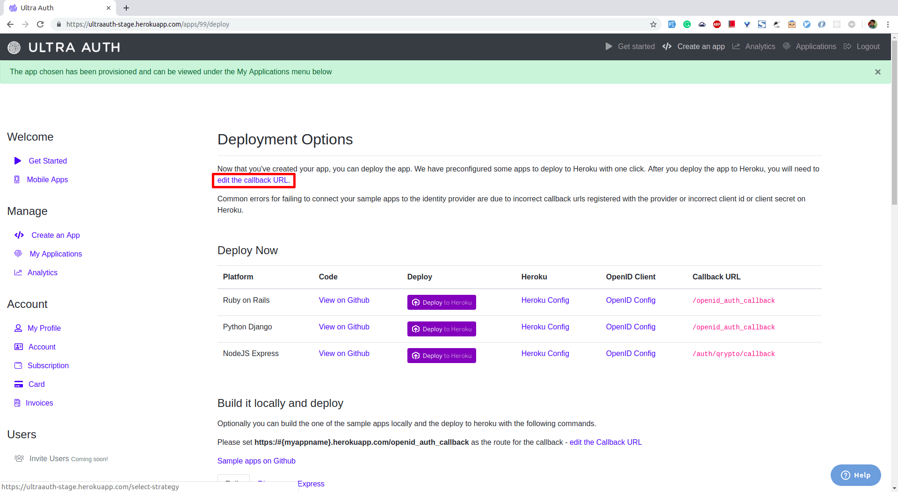

# PassportJS Biometric Login

The tutorial demonstrates how a NodeJS application can implement secure biometric login using UltraAuth.

## Configure UltraAuth

### Get Your Application Crdentials

You will require `OPENID_CLIENT_ID` and `OPENID_CLIENT_SECRET` which are necessary for your app to communicate with UltraAuth.

You can follow the following steps to retrieve them:

#### Create a Client Application
1. Login/Signup on [UltraAuth](https://ultraauth.com).
1. Click on 'Create an Application' and select 'Node'
1. The application will be created and you will prompted with the `OPENID_CLIENT_ID` and `OPENID_CLIENT_SECRET` of the application. 

#### Configure the Callback URL
A callback URL is a URL in your application where the authenticated users are redirected once they have finished the bitometric authentication with UltraAuth.

You need to configure the callback URL for your application. You can do it by clicking on the *edit callback URL* option as highlighted in the image below.

If you do not set the callback URL your users will see a `redire_uri_mismatch` error when they try to login.



The Callback URL should be your domain followed by `/auth/qrypto/callback`. For example, if your domain is *http://example.com* then your callback URL will be *http://example.com/auth/qrypto/callback*. If you are developing locally, you may set it to *localhost* also i.e. *http://localhost:8000*.

#### Configure the Post Logout URL
The Post Logout URL is the URL in your application to which the user is redirected after logging out from UltraAuth provider.

For the code of this article to work fine, you need to set the Post Callback URL the same as your domain  e.g. *http://localhost:8000*  or *http://example.com*.


## Configure Node.js to Use UltraAuth

#### Install the Dependency

We will be requiring the following packages:

- [bcrypt-nodejs](https://www.npmjs.com/package/body-parser) - Node.js body parsing middleware.
- [body-parser](https://www.npmjs.com/package/body-parser) - Node.js body parsing middleware.
- [connect-flash](https://www.npmjs.com/package/connect-flash) - a middleware to store flash messages in session
- [cookie-parser](https://www.npmjs.com/package/cookie-parser) - a middleware to parse cookies
- [ejs](https://www.npmjs.com/package/ejs) - embedded JavaScript templates
- [express-session](https://www.npmjs.com/package/express-session) - a middleware to manage sessions
- [mongoose](https://mongoosejs.com/) - elegant mongodb object modeling for node.js
- [passport](http://www.passportjs.org/) - an authentication middleware for Node.js
- [passport-ultraauth](https://github.com/ultraauth/passport-ultraauth) - an UltraAuth authentication strategy for Passport
- [sequelize](http://docs.sequelizejs.com/) - a promise-based Node.js ORM
- [sqlite3](https://www.npmjs.com/package/sqlite3) - asynchronous, non-blocking SQLite3 bindings for Node.js.

```shell
# Installation with npm
npm install bcrypt-nodejs body-parser connect-flash cookie-parser ejs express-session mongoose passport passport-ultraauth sequelize sqlite3 --save

# Installation with Yarn
yarn add bcrypt-nodejs body-parser connect-flash cookie-parser ejs express-session mongoose passport passport-ultraauth sequelize sqlite3 --save
```

#### Configure the App

In `config.js` put all the credentials and options to connect to UltraAuth successfully.

```javascript
// config.js

const crypto = require("crypto");

const config = {};

config.callbackRoot = process.env.DOMAIN_URL

config.client = {
  id: process.env.OPENID_CLIENT_ID,
  secret: process.env.OPENID_CLIENT_SECRET,
  redirectURIs: [ `${config.callbackRoot}/auth/qrypto/callback` ],
  sessionKey: crypto.randomBytes(32).toString("hex"),
  skipUserProfile: false,
  passReqToCallback: true
}

module.exports = config;
```

#### Passport Strategy

Configure Passport to use the config which we just created. To support login session, Passport serializes and deserializes user instance to and from the session.

```javascript
// app/passport.js

const OpenIdConnectStrategy = require("passport-ultraauth").Strategy;
const User = require("../app/models/user");
const config = require("../config");

module.exports = (passport) => {

  passport.serializeUser((user, done) => {
    done(null, user.id);
  });

  passport.deserializeUser((id, done) => {
    User
      .findById(id)
      .then(user => done(null, user))
      .catch(error => done(error))
    ;
  });

  passport.use(new OpenIdConnectStrategy(

    config.client,

    (req, iss, sub, profile, jwtClaims, accessToken, refreshToken, params, done) => {
      process.nextTick(async () => {
        const user = (!req.user) ? (await User.findOrCreate({ where: { qrypto_id: profile.id }}))[0] : req.user;
        user
          .update({ qrypto_id_token: params.id_token })
          .then(() => done(null, user))
          .catch((error) => done(error))
        ;
      });
    }

  ));

};
```

#### The App

Now, we will configure the app to use `express-session` and intialize the Passport strategy.

```javascript
// app.js

const http = require("http");
const app = require("express")();
const passport = require("passport");
const flash = require("connect-flash");
const cookieParser = require("cookie-parser");
const bodyParser = require("body-parser");
const session = require("express-session");

const config = require("./config");
const port = process.env.PORT || 8003;

require("./app/passport")(passport);

app.use(cookieParser());
app.use(bodyParser.json());
app.use(bodyParser.urlencoded({ extended: true }));

app.set("view engine", "ejs");

app.use(session({
    secret: "0d5b1363091af783a5760259a2743205b4efa2d84c0539ef544576ec8a001fc8",
    resave: true,
    saveUninitialized: true
}));
app.use(passport.initialize());
app.use(passport.session());
app.use(flash());

require("./app/routes.js")(app, passport);

const hs = http.createServer({}, app);

hs.listen(port);
```

#### Routes

We need to povide different routes in the application to trigger authentication and handle the callback.

```javascript
// app/route.js

const config = require("../config");

module.exports = (app, passport) => {

  app.get("/", (req, res) => {
    res.render("index.ejs");
  });

  app.get("/profile", isLoggedIn, (req, res) => {
    res.render("profile.ejs", { user : req.user });
  });

  app.get("/logout", isLoggedIn, async (req, res) => {
    const id_token_hint = req.user.qrypto_id_token;
    const encodedCallbackUri = encodeURIComponent(config.callbackRoot);
    await req.user.update({ qrypto_id_token: null });
    req.logout();
    req.session.destroy();
    res.redirect(`https://srv.qryp.to/op/session/end?post_logout_redirect_uri=${encodedCallbackUri}&id_token_hint=${id_token_hint}`);    // trailing / causes issues when there are additional parameters (?)
  });

  app.get("/auth/qrypto", passport.authenticate("openidconnect", { scope : ["profile", "email"] }));

  app.get("/auth/qrypto/callback", (req, res, next) => {
    passport.authenticate("openidconnect", (error, user, info) => {
      if (error) return next(error);
      if (!user) return res.redirect("/");
      req.logIn(user, (error) => {
        if (error) return next(error);
        return res.redirect("/profile");
      });
    })(req, res, next);
  });

};

function isLoggedIn(req, res, next) {
  if (req.isAuthenticated()) return next();
  res.redirect("/");
}
```

#### User Model

User model to store the user's information in Sqlite database.

```javascript
// app/models/user.js

const Sequelize = require("sequelize");
const sequelize = new Sequelize("sqlite:db/initech.db");

const User = sequelize.define(
  "user",
  {
    qrypto_id: { type: Sequelize.STRING, allowNull: false },
    qrypto_id_token: { type: Sequelize.STRING, allowNull: true }
  },
  {
    timestamps: false
  }
);

module.exports = User;
```

#### Index View

Default view to render the login links to the users.

```html
<!-- app/views/index.ejs -->

<!doctype html>
<html>

  <head>
    <title>Initech Data Factory</title>
    <link href="https://stackpath.bootstrapcdn.com/bootstrap/4.1.3/css/bootstrap.min.css" rel="stylesheet" integrity="sha384-MCw98/SFnGE8fJT3GXwEOngsV7Zt27NXFoaoApmYm81iuXoPkFOJwJ8ERdknLPMO" crossorigin="anonymous">
    <link href="https://stackpath.bootstrapcdn.com/font-awesome/4.7.0/css/font-awesome.min.css" rel="stylesheet" integrity="sha384-wvfXpqpZZVQGK6TAh5PVlGOfQNHSoD2xbE+QkPxCAFlNEevoEH3Sl0sibVcOQVnN" crossorigin="anonymous">
    <style>
      body { padding-top: 80px; }
    </style>
  </head>

  <body>
    <div class="container">
      <div class="jumbotron text-center">
        <h1><span class="fa fa-lock"></span> Initech Data Factory</h1>
        <a href="/auth/qrypto" class="btn btn-success mb-3"><span class="fa fa-openid"></span> Log in with Qrypto</a>
      </div>
      <div class="text-center">
        <p>A demo by <a href="http://qryp.to">Qrypto</a>.</p>
      </div>
    </div>
    <script src="https://stackpath.bootstrapcdn.com/bootstrap/4.1.3/js/bootstrap.min.js" integrity="sha384-ChfqqxuZUCnJSK3+MXmPNIyE6ZbWh2IMqE241rYiqJxyMiZ6OW/JmZQ5stwEULTy" crossorigin="anonymous"></script>
  </body>

</html>
```

#### Profile View

Profile view, to render, once the if the user is successfully logged in.

```html
<!-- app/views/profile.ejs -->

<!doctype html>
<html>

  <head>
    <title>Initech Data Factory</title>
    <link href="https://stackpath.bootstrapcdn.com/bootstrap/4.1.3/css/bootstrap.min.css" rel="stylesheet" integrity="sha384-MCw98/SFnGE8fJT3GXwEOngsV7Zt27NXFoaoApmYm81iuXoPkFOJwJ8ERdknLPMO" crossorigin="anonymous">
    <link href="https://stackpath.bootstrapcdn.com/font-awesome/4.7.0/css/font-awesome.min.css" rel="stylesheet" integrity="sha384-wvfXpqpZZVQGK6TAh5PVlGOfQNHSoD2xbE+QkPxCAFlNEevoEH3Sl0sibVcOQVnN" crossorigin="anonymous">
    <style>
      body { padding-top: 80px; word-wrap: break-word; }
    </style>
  </head>

  <body>
    <div class="container">
      <div class="page-header text-center">
        <h1><span class="fa fa-anchor"></span> User Profile</h1>
        <a href="/logout" class="btn btn-light btn-sm">Logout</a>
      </div>
      <br/>
      <div class="card-deck">
        <div class="col-auto mb-3">
          <div class="card">
            <h3 class="card-header"><span class="fa fa-openid"></span> Qrypto</h3>
            <div class="card-body">
              <p class="card-text">
                <strong>id</strong>: <%= user.qrypto_id %><br>
              </p>
            </div>
            <div class="card-footer"><small class="text-muted"></small></div>
          </div>
        </div>
      </div>
      <div class="text-center">
          <p>A demo by <a href="http://qryp.to">Qrypto</a>.</p>
      </div>
    </div>
    <script src="https://stackpath.bootstrapcdn.com/bootstrap/4.1.3/js/bootstrap.min.js" integrity="sha384-ChfqqxuZUCnJSK3+MXmPNIyE6ZbWh2IMqE241rYiqJxyMiZ6OW/JmZQ5stwEULTy" crossorigin="anonymous"></script>
  </body>

</html>
```
