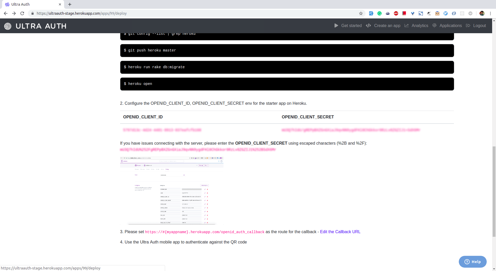

# Ruby on Rails Biometric Login

The tutorial demonstrates how a Ruby on Rails application can implement secure biometric login using UltraAuth.

## Configure UltraAuth

### Get Your Application Crdentials

You will require `OPENID_CLIENT_ID` and `OPENID_CLIENT_SECRET` which are necessary for your app to communicate with UltraAuth.

You can follow the following steps to retrieve them:

#### Create a Client Application
1. Login/Signup on [UltraAuth](https://ultraauth.com).
1. Click on 'Create an Application' and select 'Ruby on Rails'
1. The application will be created and you will prompted with the `OPENID_CLIENT_ID` and `OPENID_CLIENT_SECRET` of the application. 

#### Configure the Callback URL
A callback URL is a URL in your application where the authenticated users are redirected once they have finished the bitometric authentication with UltraAuth.

You need to configure the callback URL for your application. You can do it by clicking on the *edit callback URL* option as highlighted in the image below.

If you do not set the callback URL your users will see a `redire_uri_mismatch` error when they try to login.


The Callback URL should be your domain followed by `/auth/ultraauth/callback`. For example, if your domain is *http://example.com* then your callback URL will be *http://example.com/auth/ultraauth/callback*. If you are developing locally, you may set it to *localhost* also i.e. *http://localhost:8000*.

#### Configure the Post Logout URL
The Post Logout URL is the URL in your application to which the user is redirected after logging out from UltraAuth provider.

For the code of this article to work fine, you need to set the Post Callback URL the same as your domain  e.g. *http://localhost:8000*  or *http://example.com*.

## Configure Rails to Use UltraAuth

### Install the Dependency

We will be using [Omniauth](https://github.com/omniauth/omniauth) gem with [omniauth-ultraauth](https://github.com/ultraauth/omniauth-ultraauth) strategy to provide authentication in this Rails app.

```ruby
gem 'omniauth'
gem 'omniauth-ultraauth'
```

### Initialize Omniauth UltraAuth

Create a file named `ultraauth.rb` under `config/initializers` use the configuration below:

```ruby
  Rails.application.config.middleware.use OmniAuth::Builder do
    provider :ultraauth,
      ENV['OPENID_CLIENT_ID'],
      ENV['OPENID_CLIENT_SECRET'],
      client_options: {
        redirect_uri: "#{ENV['DOMAIN_URL']}/auth/ultraauth/callback"
      }
  end
```

#### Configure ENV Variables
In initializers we are using the environment variables as you should never store your `OPENID_CLIENT_ID` and `OPENID_CLIENT_SECRET` values in the code. You can use a gem like [Figaro](https://github.com/laserlemon/figaro) to manage your environment variables. How to configure environment variables is out of the scope for this tutorial.

`DOMAIN_URL` is the full URL of your application e.g. 'http://localhost:8000' or `http://example.com`

### Perform Authentication

We need a way for users to trigger the authentication. So let's create routes, controllers and views.

#### Routes
Add the following code in your `routes.rb` file:

```ruby
# config/routes.rb

Rails.application.routes.draw do
  root 'home#index'
  get '/auth/ultraauth', as: 'omniauth_ultraauth'
  get '/auth/ultraauth/callback', to: 'sessions#create', as: :openid_auth_callback
```

The authentication will be triggered when the user will visit `/auth/ultraauth` route. The user will be redirected to UltraAuth IDP and once the biometric authentication is performed, the Identity Provider(IDP) server will redirect the request to the callback URL, `/auth/ultraauth/callback` with the authentication data.

### Controllers

First, let's generate the controllers.

```ruby
rails generate controller home index --skip-assets
rails generate controller sessions create --skip-assets
```


Add the following code in the generated `home_controller.rb`:

```ruby
# app/controllers/home_controller.rb

class HomeController < ApplicationController
  def index
  end
end
```

Add the following code in the generated `sessions_controller.rb`:

```ruby
# app/controllers/sessions_controller.rb

class SessionsController < ApplicationController
  def create
    @response_hash = request.env['omniauth.auth'].to_hash
  end
end
```

### Views

Add the following code to the generated `index.html.erb` file:

```ruby
<!-- app/views/home/index.html.erb -->

<%= link_to "Login with UltraAuth", omniauth_ultraauth_path %>
```

Add the following code in your `create.html.erb` file:

```ruby
<!-- app/views/sessions/create.html.erb -->

<div class="container">
  <div class="row">
    <div class="col-md-6 offset-md-3 text-center">
      <section>
        <a href="https://srv.qryp.to/op/session/end?post_logout_redirect_uri=<%= ENV['DOMAIN_URL'] %>&id_token_hint=<%= @response_hash['credentials']['id_token'] %>" class="btn btn-lg btn-primary">
          Logout
        </a>

        <h2>Response from OpenID Provider</h2>
        <article>
          <h3>Auth Callback Response</h3>
          <pre><%= JSON.pretty_generate @response_hash.as_json %></pre>
        </article>
      </section>
    </div>
  </div>
</div>
```

That's it!

Once you are redirected from the IDP, if the authentication was successful, you should see the authentication data returned from the server on the page.

# Note

This app does not start session for authenticated user. Using gems like [Devise](https://github.com/plataformatec/devise), which supports Omniauth, it can be managed very easily.
